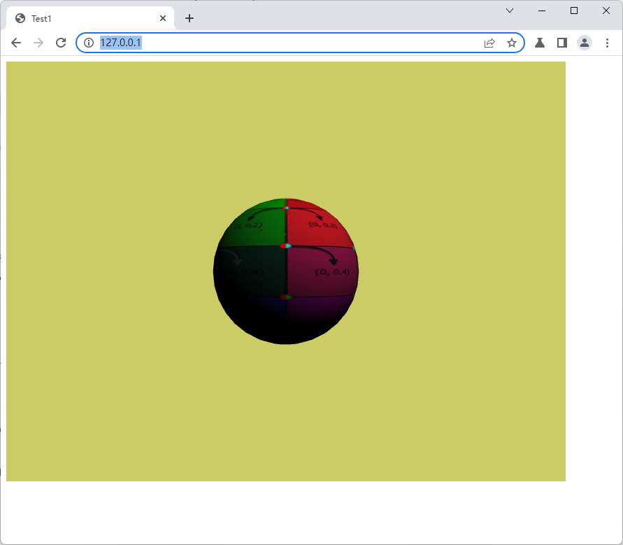

This is an attempt to hack [Three.V8](https://github.com/fynv/Three.V8) into [Chromium](https://chromium.googlesource.com/chromium/src/+/main/docs/windows_build_instructions.md)

The project tries to use the same [ANGLE](https://github.com/google/angle) based canvas context that has been used for WebGL2. OpenGL calls are made against the internal GLES2Interface.

After the hack, the generated Chromium should be able to run the code inside the "site" folder:

```html
<!DOCTYPE html>
<html>
<head>
<title>Test1</title>
</head>
<body>
	<canvas id="view" width="800" height="600"/>
</body>

<script type="text/javascript">
	async function load_binary(filename)
	{
		let res = await fetch(filename);
		let blob = await res.blob();
		return blob.arrayBuffer();
	}
	
	(async () =>
	{	
		let options = {antialias: true};
		let canvas = document.getElementById("view");
		ThreeContext.currentContext = canvas.getContext("webgl2", options);	
		
		let renderer = new GLRenderer();
		let scene = new Scene();
		
		let camera = new PerspectiveCamera(45.0, canvas.width / canvas.height, 0.1, 100.0);
		camera.setPosition(0.0, 0.0, 7.0);    
		
		let bg = new ColorBackground();
		bg.setColor(0.8, 0.8, 0.4);
		scene.background = bg;
		
		let sphere = new SimpleModel();    
		sphere.createSphere(1.0);    
		
		{
			let buf = await load_binary("assets/textures/uv-test-col.png");
			let image = ImageLoader.loadMemory(buf);
			sphere.setColorTexture(image);			
		}
		
		scene.add(sphere);
		
		function render(now) {
			renderer.render(canvas.width, canvas.height, camera, scene);
			requestAnimationFrame(render);
		}
		requestAnimationFrame(render);
		
	})();

</script>
</html>

```



To reproduce the hacks, first check out the chromium source code, then copy the folder "three_native" into src/third_party/blink/renderer/modules

Hacks to the infrastructure can be found in "hacks.diff". The aims of the hacks are:

1. Get the module "three_native" compiled
2. Upgrade the underlying ANGLE context to GLES 3.1


